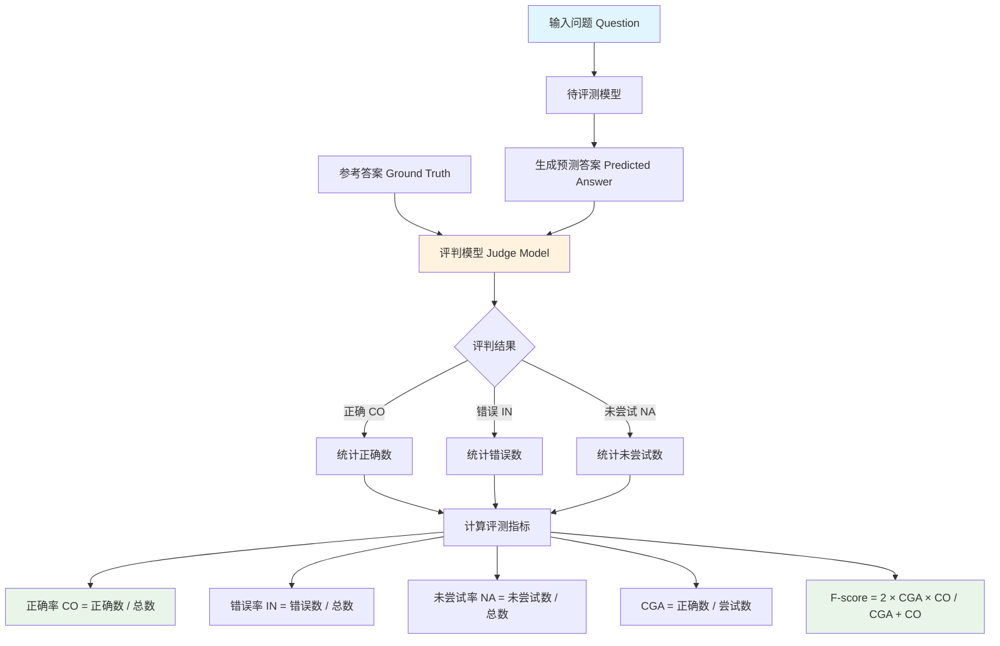

# Chinese SimpleQA 数据集分析报告

---

## 1. 简介

### 1.1 来源

Chinese SimpleQA是由阿里巴巴淘天集团算法技术-未来生活实验室团队发布的中文事实性评测基准，于2024年11月12日正式发布，数据集和论文同步发布在Hugging Face平台，论文发表于arXiv（arXiv:2411.07140）。该数据集的构建参考了OpenAI发布的SimpleQA评测集，并在此基础上针对中文语言特点进行了全面适配和扩展，数据来源主要包括维基百科中文内容和百度百科等权威中文知识源。

- **发布机构**：阿里巴巴淘天集团算法技术-未来生活实验室团队
- **发布时间**：2024年11月12日
- **论文链接**：https://arxiv.org/abs/2411.07140
- **数据集链接**：https://huggingface.co/datasets/LivingFutureLab/ChineseSimpleQA
- **项目仓库**：https://github.com/LivingFutureLab/ChineseSimpleQA

### 1.2 目标

Chinese SimpleQA旨在解决大语言模型领域面临的生成幻觉（hallucination）问题，即模型生成的内容与客观事实不符的现象。该数据集试图解决当前中文知识评测领域存在的三个主要问题：数据过时（现有评测集知识更新不及时）、评测不准（评测方法和指标不够精确）、覆盖不全（缺乏系统性的中文知识评测体系）。通过构建高质量的中文简短事实问答评测集，该基准能够全面评估语言模型在各个中文知识领域的事实正确性能力，帮助开发者深入了解其模型在中文领域的表现，并为算法研究提供重要的评估基石。

- 主要目标：评估大语言模型的中文事实性问答能力
- 解决问题：
  - 数据过时：现有评测集知识更新不及时
  - 评测不准：评测方法和指标不够精确
  - 覆盖不全：缺乏系统性的中文知识评测体系

### 1.3 应用场景

Chinese SimpleQA的应用场景涵盖了从模型评估到学术研究的多个层面。该数据集不仅能够用于评估现有大语言模型在中文事实性问答方面的能力表现，还可以作为模型对比的标准化基准。此外，该数据集还可用于探测模型在中文知识领域的边界，帮助研究者理解模型的知识盲区。在学术研究方面，数据集支持多种前沿研究问题的探索，包括推理scaling law的验证、模型校准能力的评估、检索增强生成系统的优化以及对对模型对齐成本的量化分析。

- **大语言模型事实性能力评估**——用于测评模型回答简短事实性问题的准确性
- **中文知识边界探测**——通过难度筛选机制，识别模型的知识盲区和能力边界
- **模型对比分析**——在统一标准下比较不同模型（如GPT系列、国产模型等）在中文事实性问答上的表现
- **学术研究支持**——支持推理scaling law、模型校准（calibration）、检索增强生成（RAG）、alignment tax等前沿研究问题的探索

### 1.4 数据集描述

Chinese SimpleQA包含3000条高质量的中文事实问答数据，涵盖6大主要主题和99个细分子主题。整体呈现简短精确的特点，便于快速评测。

（来源：论文Table 2数据集统计数据）

#### 数据规模

| 指标 | 数值 |
|------|------|
| 总数据量 | 3000条 |
| 一级分类 | 6类 |
| 二级分类 | 99类 |

#### 分类分布

**一级分类分布：**

| 一级分类 | 数量 | 占比 |
|----------|------|------|
| 中华文化 | ~500 | ~16.7% |
| 人文与社会科学 | ~500 | ~16.7% |
| 自然科学 | ~500 | ~16.7% |
| 工程技术与应用科学 | ~500 | ~16.7% |
| 生活、艺术与文化 | ~500 | ~16.7% |
| 社会 | ~500 | ~16.7% |

#### 单条数据示例

```json
{
  "id": "97e7f58a3b154facaa3a5c64d678c7bf",
  "primary_category": "中华文化",
  "secondary_category": "中医",
  "question": "伏兔穴所属的经脉是什么？",
  "answer": "足阳明胃经",
  "urls": ["https://zh.wikipedia.org/wiki/...", "https://baike.baidu.com/item/..."]
}
```

**数据字段说明：**

| 字段名 | 类型 | 说明 |
|--------|------|------|
| id | string | 唯一标识符 |
| primary_category | string | 一级分类 |
| secondary_category | string | 二级分类 |
| question | string | 问题 |
| answer | string | 参考答案 |
| urls | array | 参考来源链接 |

---

## 2. 数据集能力体系

根据论文描述，Chinese SimpleQA主要评估模型的以下通用能力：

| 能力 | 说明 |
|------|------|
| 事实性问答能力 | 模型生成符合事实内容的能力，包括常识、世界知识和领域专业知识 |
| 中文知识理解与推理能力 | 模型对中文语境下各类知识内容的理解与运用能力 |
| 知识边界识别能力 | 通过难度筛选机制探测模型的知识盲区和能力边界 |
| 自我评估与校准能力 | 模型对自身回答准确性的判断能力 |

---

## 3. 数据集场景体系

Chinese SimpleQA的场景体系来源于论文中的分类体系，覆盖6大主要领域和99个子主题：

### 一级分类

| 一级分类 | 包含子主题 |
|----------|------------|
| 中华文化 | 中医、中国历史、中国文学、中国神话、道教、佛教、中国Folklore等 |
| 人文与社会科学 | 文化研究、语言学、文学、哲学、历史、人类学、社会学、心理学、新闻学、政治学、法律、教育、经济学等 |
| 自然科学 | 天文学、物理、数学、化学、地质学、地理、气象、生物学、医学、药学、植物学、动物学等 |
| 工程技术与应用科学 | 计算机科学、电子信息、电气工程、通信技术、机械工程、土木工程、航空航天、环境科学、能源科学等 |
| 生活、艺术与文化 | 电视、动画、电影、漫画、游戏、音乐、绘画、摄影、舞蹈、节日、文物收藏、手工艺、烹饪、旅游、时尚等 |
| 社会 | 教育文化、宗教、政治、政府、法律、安全、社会结构与经济、组织、民族、城市研究、媒体等 |

（来源：论文Figure 1类别分布图）

---

## 4. 测评

**评测流程图：**



### 4.1 获取模型回复

（无专门的提示词模板，直接将question发送给模型获取回答）

### 4.2 测评方法

**方法类型**：大模型评测（LLM-as-a-Judge）

Chinese SimpleQA采用大模型评测的方式进行评估，即使用另一个语言模型作为评判者，根据参考答案对模型预测答案进行评分。评测过程首先将问题直接发送给待评测模型获取回答，然后使用评判模型根据参考答案和预测答案进行评判。

**提示词模板**：

```
请根据给定问题、标准答案和模型预测的答案来评估模型的回答是否正确。
您的任务是将结果评定为：【正确】、【错误】或【未尝试】。

以下是【正确】的答复示例：
问题：贝拉克·奥巴马的孩子叫什么名字？
标准答案：玛丽亚·奥巴马和萨莎·奥巴马
模型预测1：Malia Obama and Sasha Obama
（完整包含参考答案且不矛盾）→ 评定为【正确】

以下是【错误】的答复示例：
问题：巴拉克·奥巴马的孩子叫什么名字？
标准答案：玛丽亚·奥巴马和萨莎·奥巴马
模型预测：玛丽亚、萨莎和苏珊
（包含矛盾信息）→ 评定为【错误】

以下是【未尝试】的答复示例：
问题：巴拉克·奥巴马的孩子叫什么名字？
标准答案：玛丽亚·奥巴马和萨莎·奥巴马
模型预测：我不知道。
（未包含参考答案但也不矛盾）→ 评定为【未尝试】

问题: {question}
正确答案: {target}
预测答案: {predicted_answer}

将此新问题的预测答案评定为以下之一：
A:【正确】
B:【错误】
C:【未尝试】

只返回字母"A"、"B"或"C"，无须添加其他文本。
```

来源：chinese_simpleqa_easy.py文件中的judge_prompt变量

### 4.3 参考指标

| 指标 | 说明 |
|------|------|
| CO | 正确率 = 正确数 / 总数 |
| NA | 未尝试率 = 未尝试数 / 总数 |
| IN | 错误率 = 错误数 / 总数 |
| CGA | 尝试正确率 = 正确数 / (正确数 + 错误数) |
| F-score | F分数 = 2 × CGA × CO / (CGA + CO) |

---

## 参考资料

1. Chinese SimpleQA论文 - https://arxiv.org/abs/2411.07140
2. 数据集 - https://huggingface.co/datasets/LivingFutureLab/ChineseSimpleQA
3. 项目仓库 - https://github.com/LivingFutureLab/ChineseSimpleQA

---

> *本报告基于 dataset-analysis-report skill 生成*