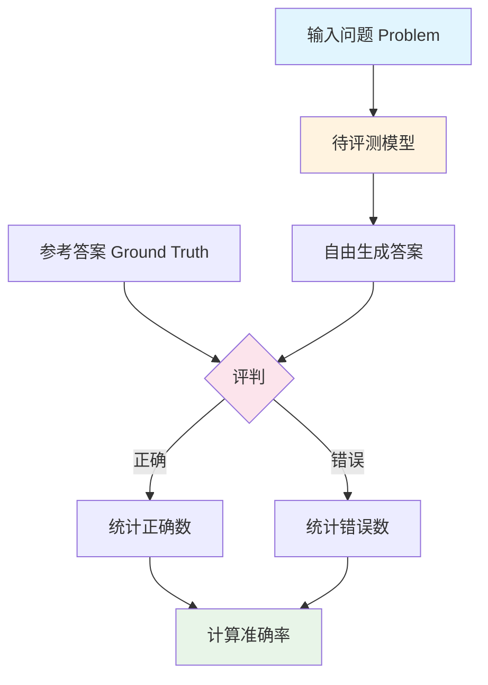

# GPQA Diamond 数据集分析报告

---

## 1. 简介

### 1.1 来源

GPQA（全称：Graduate-Level Google-Proof Q&A Benchmark）是由David Rein、Betty Li Hou等研究人员在2024年发布的研究生级别问答基准数据集，论文发表于arXiv（arXiv:2311.12022），并在First Conference on Language Modeling上展示。该数据集旨在构建一个"Google防作弊"的研究生级别科学问答基准，即题目设计使得模型无法通过简单的网络搜索获得答案，需要具备真正的专业知识理解能力。数据集可通过Hugging Face获取（https://huggingface.co/datasets/idavidrein/gpqa）。

- **发布机构**：NYU、Columbia University等机构
- **发布时间**：2024年
- **论文链接**：https://arxiv.org/abs/2311.12022
- **数据集链接**：https://huggingface.co/datasets/idavidrein/gpqa
- **项目仓库**：https://github.com/idavidrein/gpqa

### 1.2 目标

GPQA旨在解决当前大语言模型评测基准过于简单、无法有效区分模型能力的问题。该数据集试图解决以下问题：现有基准（如MMLU、ARC等）对于最新的大语言模型来说已经过于简单，模型可以通过网络搜索或记忆大量训练数据来获得高分，而不需要真正理解问题。因此，GPQA构建了一个研究生级别的问答基准，题目由领域专家精心设计，确保题目足够难且具有挑战性，能够真正测试模型的研究生级别科学知识理解和推理能力。

- 主要目标：构建研究生级别的Google-Proof问答基准，测试模型的专业知识理解能力
- 解决问题：
  - 现有基准过于简单：MMLU、ARC等基准对于最新大模型已过于简单
  - 网络搜索作弊：现有基准题目可通过网络搜索获得答案
  - 缺乏专业性测试：缺乏真正测试研究生级别科学知识的基准

### 1.3 应用场景

GPQA的应用场景涵盖了从模型评估到学术研究的多个层面。该数据集不仅能够用于评估现有大语言模型在研究生级别科学问答方面的能力表现，还可以作为模型对比的标准化基准。此外，该数据集还可用于探测模型在专业科学领域的知识边界，帮助研究者理解模型的能力局限。

- **研究生级别科学问答评估**——评估模型在研究生级别科学问题上的理解和推理能力
- **模型能力对比分析**——在统一标准下比较不同模型（如GPT-4、Claude等）在研究生级别问题上的表现
- **Google-Proof测试**——验证模型是否真正理解知识而非依赖网络搜索
- **学术研究支持**——支持大语言模型在专业领域能力评估的前沿研究

### 1.4 数据集描述

GPQA Diamond包含198道研究生级别的多项选择题，涵盖化学、物理和生物三个主要科学领域。所有题目均由领域专家设计，确保题目具有足够的难度和专业性。数据集包含三个字段：problem（问题描述，包含问题和选项）、solution（正确答案）、domain（领域分类）。

（来源：README.md、数据文件分析）

#### 数据规模

| 指标 | 数值 |
|------|------|
| 总数据量 | 198条 |
| 领域数 | 3个 |

#### 领域分布

**领域分布：**

| 领域 | 数量 | 占比 |
|------|------|------|
| Chemistry | 93 | 47.0% |
| Physics | 86 | 43.4% |
| Biology | 19 | 9.6% |

#### 单条数据示例

```json
{
  "problem": "Two quantum states with energies E1 and E2 have a lifetime of 10^-9 sec and 10^-8 sec, respectively. We want to clearly distinguish these two energy levels. Which one of the following options could be their energy difference so that they can be clearly resolved?",
  "solution": "\\boxed{10^-4 eV}",
  "domain": "Physics"
}
```

#### 数据字段说明

| 字段名 | 类型 | 说明 |
|--------|------|------|
| problem | string | 问题描述（包含问题文本和选项） |
| solution | string | 正确答案（使用\boxed{}格式） |
| domain | string | 领域分类（Chemistry/Physics/Biology） |

---

## 2. 数据集能力体系

根据论文描述，GPQA主要评估模型的以下通用能力：

| 能力 | 说明 |
|------|------|
| 研究生级别科学知识理解能力 | 理解研究生水平科学概念和原理的能力 |
| 专业领域推理能力 | 在化学、物理、生物等领域进行专业推理的能力 |
| 多步推理能力 | 解决需要多步推理的复杂科学问题的能力 |
| 专业知识应用能力 | 将专业知识应用于解决实际问题的能力 |

**评测指标：**

| 指标 | 说明 |
|------|------|
| 准确率 | 模型选择正确答案的比例 |
| 多领域表现 | 在不同科学领域（化学、物理、生物）的表现 |

（来源：README.md、论文）

---

## 3. 数据集场景体系

GPQA的场景体系来源于科学领域分类，覆盖三个主要科学领域：

### 一级分类

| 一级分类 | 包含子主题 |
|----------|------------|
| Chemistry | 有机化学、无机化学、物理化学、生物化学等 |
| Physics | 量子力学、电磁学、热力学、现代物理等 |
| Biology | 分子生物学、细胞生物学、遗传学、生物化学等 |

（来源：数据分析）

---

## 4. 测评

**评测流程图：**



### 4.1 获取模型回复

**提示词模板**（来自prompts/chain_of_thought.txt）：

```
Question: {question}
Let's think step by step:
{reasoning_steps}
The correct answer is {answer}
```

来源：prompts/chain_of_thought.txt

### 4.2 测评方法

**方法类型**：自由生成式问答

GPQA采用自由生成式问答的方式进行评估，具体流程如下：首先将问题发送给待评测模型，让模型自由生成答案，然后将模型生成的答案与参考答案进行比较，评判其是否正确，最后计算模型在所有问题上的准确率。评测支持多种提示方式，包括zero_shot、few_shot、chain_of_thought等。

**评测模式：**

| 模式 | 说明 |
|------|------|
| zero_shot | 直接问答，不提供示例 |
| few_shot | 提供5个问答示例 |
| zero_shot_chain_of_thought | 引导模型逐步推理 |
| chain_of_thought | 提供思维链示例 |
| retrieval | 结合Bing搜索的检索增强 |
| retrieval_content | 结合Bing搜索和网页内容 |

**基线结果（GPT-4）：**

| 模式 | 准确率 |
|------|--------|
| zero_shot | ~17% |
| 5_shot | ~24% |
| zero_shot_chain_of_thought | ~23% |
| chain_of_thought | ~25% |

（来源：baseline_results、README.md）

---

## 参考资料

1. GPQA论文 - https://arxiv.org/abs/2311.12022
2. 数据集 - https://huggingface.co/datasets/idavidrein/gpqa
3. 项目仓库 - https://github.com/idavidrein/gpqa

---

> *本报告基于 dataset-analysis-report skill 生成*