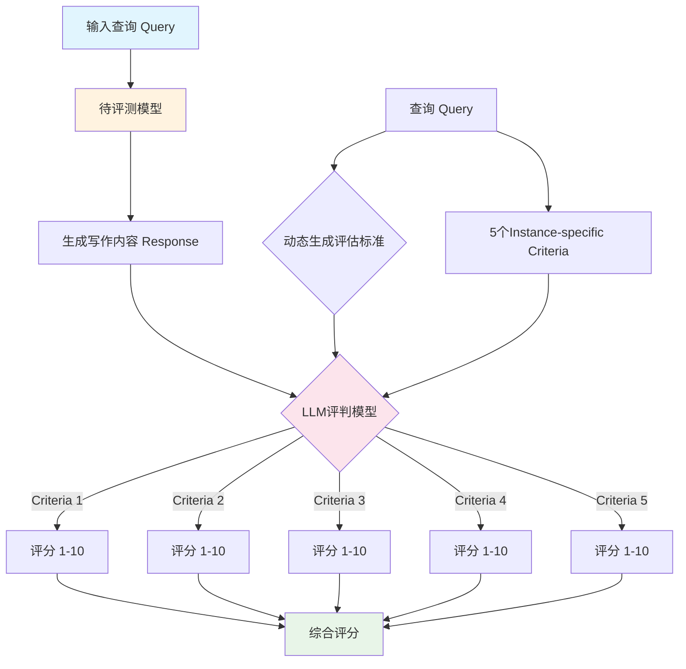

# WritingBench 数据集分析报告

---

## 1. 简介

### 1.1 来源

WritingBench是由X-PLUG团队（阿里巴巴等机构）发布的大语言模型写作能力评测基准，于2025年发布，论文发表于arXiv（arXiv:2503.05244）。该数据集旨在全面评估大语言模型在真实场景下的写作能力，包含1000条来自真实写作场景的查询，涵盖6大主要领域和100个细分子领域。数据集整合了多种来源的材料，每个查询都配有5个实例特定的评估标准，可通过LLM评判者或微调的Critic模型进行评分。

- **发布机构**：X-PLUG团队（阿里巴巴等机构）
- **发布时间**：2025年
- **论文链接**：https://arxiv.org/abs/2503.05244
- **项目仓库**：https://github.com/X-PLUG/WritingBench

### 1.2 目标

WritingBench旨在解决现有写作评测基准缺乏多样性和真实世界适用性的问题。当前大语言模型在写作任务上的评估面临以下挑战：查询缺乏多样性、评估标准不够细化、缺乏instance-specific的评分标准。因此，WritingBench构建了一个综合性的写作评测基准，采用模型增强查询生成和人类参与 refinement 的混合 pipeline，确保数据集既具有多样性又具有真实世界适用性。

- 主要目标：全面评估大语言模型的写作能力
- 解决问题：
  - 查询缺乏多样性：现有基准的查询过于简单或单一
  - 评估标准不够细化：缺乏针对具体查询的评估标准
  - 缺乏instance-specific评分：每个查询应有独特的评估标准

### 1.3 应用场景

WritingBench的应用场景涵盖了从模型评估到学术研究的多个层面。该数据集不仅能够用于评估现有大语言模型在写作方面的能力表现，还可以作为模型对比的标准化基准。此外，该数据集还可用于探测模型在各类写作任务上的能力边界，帮助研究者理解模型的写作能力局限。

- **大语言模型写作能力评估**——全面评估模型在各类写作任务上的能力表现
- **模型对比分析**——在统一标准下比较不同模型在写作任务上的表现
- **写作能力边界探测**——识别模型在不同写作领域的能力边界
- **学术研究支持**——支持写作能力评估、模型评分、Critic模型训练等前沿研究

### 1.4 数据集描述

WritingBench包含1000条高质量的写作查询，涵盖6大主要领域和100个细分子领域。数据字段包括：index（唯一标识）、domain1（一级领域）、domain2（二级领域）、lang（语言）、query（用户查询）、checklist（评估标准）。每个查询都配有5个实例特定的评估标准（checklist），每个标准包含：名称、详细描述、1-2/3-4/5-6/7-8/9-10分的评分规则。

（来源：README.md、论文）

#### 数据规模

| 指标 | 数值 |
|------|------|
| 总数据量 | 1000条 |
| 一级分类 | 6类 |
| 二级分类 | 100类 |

#### 领域分布

**一级分类分布：**

| 一级分类 | 数量 | 占比 |
|----------|------|------|
| Finance & Business | 210 | 21.0% |
| Politics & Law | 201 | 20.1% |
| Literature & Arts | 183 | 18.3% |
| Academic & Engineering | 167 | 16.7% |
| Advertising & Marketing | 128 | 12.8% |
| Education | 111 | 11.1% |

#### 单条数据示例

```json
{
  "index": 1,
  "domain1": "Academic & Engineering",
  "domain2": "Paper Outline",
  "lang": "zh",
  "query": "撰写一篇关于机器学习在制造业质量控制中应用的研究论文...",
  "checklist": [
    {
      "name": "论文结构完整性",
      "criteria_description": "评估论文是否提供了符合学术规范的完整结构...",
      "1-2": "缺少关键结构元素...",
      "3-4": "结构不完整...",
      "5-6": "结构基本完整...",
      "7-8": "结构合理...",
      "9-10": "结构完全符合学术论文标准..."
    }
  ]
}
```

**数据字段说明：**

| 字段名 | 类型 | 说明 |
|--------|------|------|
| index | int | 唯一标识符（1-1000） |
| domain1 | string | 一级领域分类 |
| domain2 | string | 二级领域分类 |
| lang | string | 语言（zh/en） |
| query | string | 用户写作查询 |
| checklist | array | 5个评估标准（每个包含评分规则） |

---

## 2. 数据集能力体系

根据论文描述，WritingBench主要评估模型的以下通用能力：

| 能力 | 说明 |
|------|------|
| 内容生成能力 | 根据用户需求生成符合要求的写作内容 |
| 结构组织能力 | 合理组织文章结构，保持逻辑连贯 |
| 语言表达能力 | 使用恰当的语言风格和表达方式 |
| 专业领域写作 | 在特定专业领域（金融、法律、教育等）的写作能力 |
| 格式规范遵循 | 遵循不同写作场景的格式要求 |
| 创意写作能力 | 创意性和独特性的写作表现 |

**评测指标：**

| 指标 | 说明 |
|------|------|
| 综合得分 | 1-10分制，最终评分（显示时乘以10，即10-100分） |
| 多维度评分 | 每个query有5个instance-specific评估标准 |
| Criteria评分 | 每个标准单独评分1-10分 |

（来源：README.md、论文）

---

## 3. 数据集场景体系

WritingBench的场景体系来源于论文中的分类体系，覆盖6大主要领域和100个细分子主题：

### 一级分类

| 一级分类 | 包含子主题 |
|----------|------------|
| Finance & Business | 金融报告、商业计划、投资分析、审计报告等 |
| Politics & Law | 法律文书、合同协议、政策分析、诉讼文书等 |
| Literature & Arts | 小说创作、诗歌、剧本、影评、书评等 |
| Academic & Engineering | 学术论文、技术报告、专利申请书、研究提案等 |
| Advertising & Marketing | 广告文案、营销方案、品牌故事、社交媒体内容等 |
| Education | 教学设计、课程大纲、教案、教育研究报告等 |

（来源：README.md、论文 Table 1）

---

## 4. 测评

**评测流程图：**



### 4.1 获取模型回复

（提示词模板：根据query让模型生成写作内容，详见generate_response.py）

### 4.2 测评方法

**方法类型**：LLM-as-Judge（自由生成式问答）

WritingBench采用LLM-as-Judge的方式进行评估，具体流程如下：首先将查询（query）发送给待评测模型获取写作内容（response），然后使用评判模型（默认Claude-Sonnet-4-5）根据动态生成的评估标准（5个instance-specific criteria）对response进行评分。每个criteria独立评分1-10分，并提供评分理由。最终综合5个criteria的评分计算总体得分（显示时乘以10，即10-100分）。

**评分规则（来自prompt.py）：**

| 分数区间 | 质量描述 |
|----------|----------|
| 1-2分 | 严重缺陷和重大问题，无法满足基本功能要求 |
| 3-4分 | 存在明显不足，影响整体效果，需要改进 |
| 5-6分 | 合格但不出色，达到基本要求，多数模型可获得此分数 |
| 7-8分 | 表现良好，执行到位，但需要小幅改进以达到卓越 |
| 9-10分 | 卓越表现，所有方面都得到最佳处理，质量和效果无可挑剔 |

（来源：prompt.py、README.md）

**评测配置（来自README.md）：**

| 阶段 | 参数 |
|------|------|
| 响应生成 | top_p: 0.8, top_k: 20, temperature: 0.7, max_length: 16000 |
| 评分 | top_p: 0.95, temperature: 1.0, max_length: 2048 |

---

## 参考资料

1. WritingBench论文 - https://arxiv.org/abs/2503.05244
2. 项目仓库 - https://github.com/X-PLUG/WritingBench
3. Hugging Face - https://huggingface.co/spaces/WritingBench/WritingBench

---

> *本报告基于 dataset-analysis-report skill 生成*