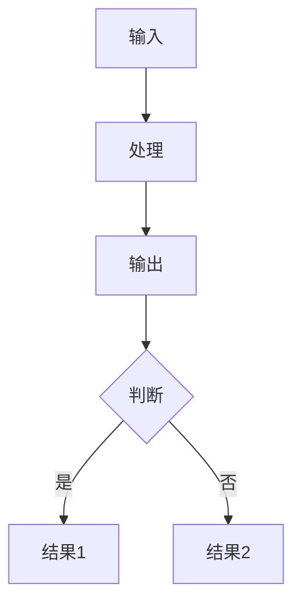

# {数据集名称} 数据集分析报告

---

## 1. 简介

### 1.1 来源

{数据集名称}是由{机构名称}发布的{数据集类型}，于{发布时间}正式发布，{补充说明数据集的背景、参考了什么其他数据集、数据来源等}。

- **发布机构**：{机构名称}
- **发布时间**：{YYYY/MM/DD}
- **论文链接**：{论文URL（如有）}
- **数据集链接**：{Hugging Face数据集链接（如有）}
- **项目仓库**：{GitHub仓库链接（如有）}

### 1.2 目标

{数据集名称}旨在解决{领域}面临的{核心问题}。该数据集试图解决当前{领域}存在的几个主要问题：{问题1}、{问题2}、{问题3}。通过构建{高质量的xxx评测集}，该基准能够{评估什么能力}，帮助开发者{了解什么}，并为{什么研究}提供重要的评估基石。

- 主要目标：{核心目标描述}
- 解决问题：
  - {问题1}：{具体描述}
  - {问题2}：{具体描述}

### 1.3 应用场景

{数据集名称}的应用场景涵盖了从模型评估到学术研究的多个层面。该数据集不仅能够用于评估现有大语言模型在特定任务方面的能力表现，还可以作为模型对比的标准化基准。此外，该数据集还可用于探测模型在特定领域的边界，帮助研究者理解模型的能力范围和局限性。在学术研究方面，数据集支持多种前沿研究问题的探索，包括但不限于模型能力评估、领域适应性研究、性能对比分析等。

{数据集名称}的主要应用场景包括：

- **{场景1}**——{场景描述}
- **{场景2}**——{场景描述}
- **{场景3}**——{场景描述}

### 1.4 数据集描述

{数据集名称}包含**{N条}**高质量的评测数据。{补充数据特点，如主题分布、数据来源等}。

#### 数据规模

| 指标 | 数值 |
|------|------|
| 总数据量 | {N条} |
| {可选：一级分类数} | {N类} |
| {可选：二级分类数} | {N类} |

{可选：如有分类信息，可添加以下内容}
<!-- #### 分类分布

**一级分类分布：**

| 一级分类 | 数量 | 占比 |
|----------|------|------|
| {分类1} | {N} | {X%} |
| {分类2} | {N} | {X%} | -->

#### 单条数据示例

```json
{
  {字段1}: {值},
  {字段2}: {值},
  {字段3}: {值}
}
```

**数据字段说明：**

| 字段名 | 类型 | 说明 |
|--------|------|------|
| {字段1} | {string} | {说明} |
| {字段2} | {string} | {说明} |
| {字段3} | {string} | {说明} |

{可选：如有长度统计信息，可添加以下表格}
<!-- #### 长度统计

| 字段 | 平均 | 最小 | 最大 |
|------|------|------|------|
| {字段1} | {N} | {N} | {N} |
| {字段2} | {N} | {N} | {N} | -->

> **数据案例参考**：
> - [case1_dataset_analysis_report.md](../references/cases/case1_dataset_analysis_report.md) - Chinese SimpleQA
> - [case2_alignbench_analysis_report.md](../references/cases/case2_alignbench_analysis_report.md) - AlignBench

---

## 2. 数据集能力体系

根据论文描述，{数据集名称}主要评估模型的以下通用能力：

| 能力 | 说明 |
|------|------|
| {能力1} | {说明} |
| {能力2} | {说明} |
| {能力3} | {说明} |

---

## 3. 数据集场景体系

{数据集名称}的场景体系来源于{来源}，覆盖**{N}大主要领域**和**{N}个细分子主题**：

### 一级分类

| 一级分类 | 包含子主题 |
|----------|------------|
| {分类1} | {子主题1, 子主题2, ...} |
| {分类2} | {子主题1, 子主题2, ...} |
| {分类3} | {子主题1, 子主题2, ...} |

（来源：{论文Figure X / README Section}）

---

## 4. 测评

{可选：添加评测流程图，使用Mermaid语法}
<!--
**评测流程图：**


-->

### 4.1 获取模型回复

{说明如何获取模型回复，如果有提示词模板则填写，没有则使用默认描述}

（无专门的提示词模板，直接将question发送给模型获取回答）

### 4.2 测评方法

**方法类型**：{评估器/提示词评估}

{数据集名称}采用**{方法类型}**的方式进行评估。{简要说明评测方法的核心原理和流程}。

**提示词模板**：

```
{提示词模板内容}

来源：{论文/代码文件}
```

### 4.3 参考指标

| 指标 | 说明 |
|------|------|
| {指标1} | {说明} |
| {指标2} | {说明} |

{可选：如有评分规则，可添加以下内容}
<!--
**评分规则：**

| 分数区间 | 质量描述 |
|----------|----------|
| {X-Y分} | {描述} |
| {X-Y分} | {描述} |
-->

---

## 参考资料

1. {论文标题} - {论文URL（如有）}
2. {数据集} - {Hugging Face数据集链接（如有）}
3. {项目仓库} - {GitHub仓库链接（如有）}

---

> *本模板基于 dataset-analysis-report skill 生成*